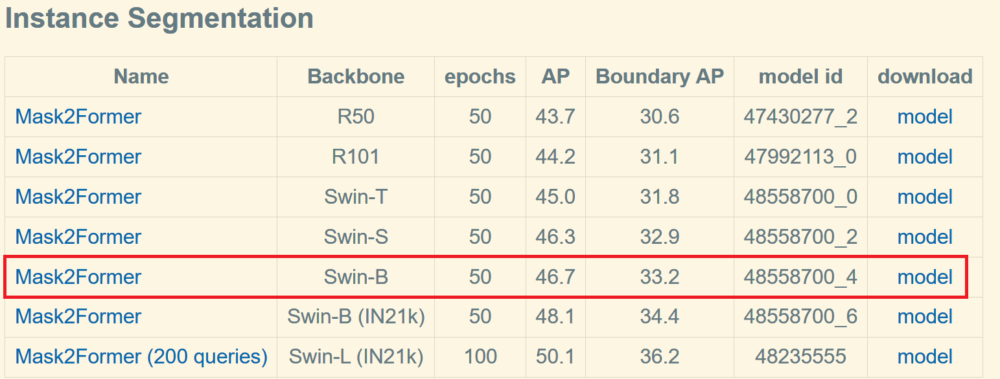
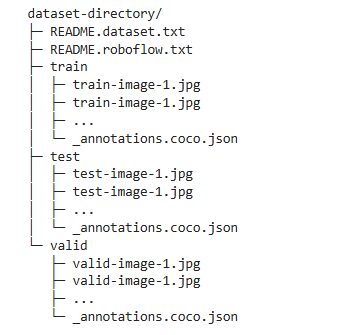

# SAR_RARP50_Surg_Instru_Seg

The code of Segmentation of Surgical Instrumentation on the SAR_RARP50 dataset.

The project plans to use the **Mask2Former model which used Swin B as the backbone in detectron2** to implement the semantic segmentation. In addition, the instance segmentation model trained on the COCO dataset in Model Zoo was intended to be utilised as the pre-trained model (as shown in the red rectangle)

My schedule is as follows:

1. **Process the dataset**:

- Take training dataset 2 as the training set, training dataset 1 as the validation set,

and test dataset as the test set.

- Extract the image in the video* folder corresponding to the same file name ground

truth image in the segmentation folder respectively in the training dataset 1, 2 and

test dataset.

- **Get the standard COCO format annotation .json file from the existing dataset**.

2. **Prepare the dataset: upload the dataset to the Google Cloud as mounted to the colab platform, as follows in standard COCO dataset format**:

3. **Take the dataset as the custom dataset to train and fine-tune the model.**

- Apply resize, and random flip for data argumentation;
- Alter the learning rate with decaying.

4. **Test (Inference) on the test dataset and compute the metrics ***mIoU and mNSD*** indicated in the dataset explanation**.
